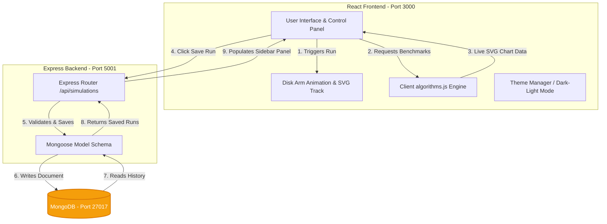

# LOOK Disk Scheduling visualizer & Multi-Algorithm Benchmarking Dashboard

An interactive, full-stack **MERN (MongoDB, Express, React, Node.js)** application designed to visualize the **LOOK** disk scheduling algorithm and benchmark it in real time against other classic disk scheduling algorithms.

---

## 🏗️ System Architecture & Data Flow

The system consists of a decoupled frontend client, a unified Express API gateway, and a MongoDB database. Below is the system design and interaction flow represented in Mermaid.js:



---

## 🚀 Key Features

- **Interactive LOOK Animation**: Play, pause, reset, or step-through disk arm animations over track ranges `0` to `199`. Speed control ranges from `0.5x` to `4.0x`.
- **Live Multi-Algorithm Benchmarking**: Instantly calculates and generates an SVG comparison chart for the same queue against:
  - FCFS (First-Come, First-Served)
  - SSTF (Shortest Seek Time First)
  - SCAN (Elevator)
  - C-SCAN (Circular SCAN)
  - C-LOOK (Circular LOOK)
- **Database Persistence**: Save runs to MongoDB with a custom title, loading them back into the simulator or deleting them directly from a history sidebar.
- **Optimization Analytics**: Displays relative percentage improvements in disk travel distance gained by using LOOK.
- **Dynamic Themes**: Built-in support for switching between Dark Mode and Light Mode.

---

## 📂 Project Structure

```text
WAF-LOOK-Project/
├── package.json                 # Root package.json (Concurrently runner)
├── .gitignore                   # Root gitignore rules
├── README.md                    # System Design & Documentation
├── backend/                     # Node/Express Server
│   ├── package.json
│   ├── .env                     # Configuration (DB Connection, Port)
│   ├── server.js                # Server entry point
│   ├── models/
│   │   └── Simulation.js        # Mongoose Simulation Schema
│   └── routes/
│       └── simulations.js      # REST Endpoint handlers
└── look-project/                # React client app
    ├── package.json             # CRA configured with backend proxy
    ├── public/
    │   └── index.html           # Main HTML container
    └── src/
        ├── App.js               # Entry Component router
        ├── index.js             # Root bootstrapper
        ├── algorithms.js        # Calculation implementations of FCFS, SSTF, SCAN, etc.
        └── look-disk-algorithm.jsx # Main Dashboard component (Visualizer, Charts, History)
```

---

## ⚡ Math Formulations Implemented

1. **FCFS (First-Come, First-Served)**
   \[S_{\text{FCFS}} = \sum_{i=1}^{n} |q_i - q_{i-1}| \quad \text{where } q_0 = \text{head}\]
2. **SSTF (Shortest Seek Time First)**
   At each step \(i\), selects next track \(q_i \in Q_{\text{remaining}}\) which minimizes absolute distance:
   \[\min_{q \in Q_{\text{remaining}}} |q - q_{i-1}|\]
3. **LOOK (Elevator)**
   Sorts tracks, partitions them into left and right groups based on head. Services in the active direction until the outermost request is reached, then reverses. Never goes to boundaries (`0` or `199`) unless requested.

---

## 🛠️ Installation & Setup

### Prerequisites
- [Node.js](https://nodejs.org/) (v16.0 or higher recommended)
- [MongoDB](https://www.mongodb.com/try/download/community) running locally on port `27017`

### Step 1: Install Dependencies
Run the installation script in the project root to configure dependencies for the root, backend, and frontend folders:
```bash
npm run install-all
```

### Step 2: Configure Environment Variables
Inside the `backend/` folder, confirm or edit the `.env` settings:
```env
PORT=5001
MONGO_URI=mongodb://localhost:27017/look-disk-scheduling
```

### Step 3: Run the Application
Launch both backend APIs and React frontend simultaneously:
```bash
npm start
```
Open [http://localhost:3000](http://localhost:3000) in your browser.

---

## 📡 REST API Endpoints

The Express server handles these actions at endpoint `/api/simulations`:

| Method | Endpoint | Description |
| :--- | :--- | :--- |
| **GET** | `/api/simulations` | Retrieve all saved simulations sorted by date (newest first). |
| **POST** | `/api/simulations` | Save a new simulation run (includes input configuration, LOOK order, and benchmark numbers). |
| **DELETE**| `/api/simulations/:id` | Delete a saved simulation by ID. |
